# ProjectML_Course
Machine learning - Project_A 

**Authors:** Alessandro Testi, Elia Bocini, Francesco Fiaschi  
**Course:** Machine Learning  
**Date:** February 2026  

## Project Aim
The aim of this project is to implement a Neural Network framework built from scratch using only NumPy library.
The neural network framework is used to test and evaluate the performance on two different task:
- *Monk's Dataset:* a standard benchmark for classification task
- *ML Cup:* dataset for regression task provided by course.

## Implementation Details
The framework is divided in object class to ensure modularization, legibility and security.
### Architecture
- **Layers**: the network is composed of *fully connected layer*. Each layer is indipendent and managing:
  - **Weights and Biases**: to compute the linear projection (`net` value)
  - **Activation Function**: to produce the output `out` the of the layer (non-linear)
  - **Backward Pass**: to propagate the error `delta` through the weights (*chain rule*)
- **Neural Network**: the main class that create the entire architecture.
  - **Initialization:** implement the dynamic `std` based on fan-in/fan-out (Xavier/Glorot or He)
  - **Forward**: compute all layers' outputs
  - **Backpropagation**: computation of gradient via chain rule
  - **Gradient Descent:**
    - *L2 Regolarization*
    - *Momentum*
- **Training:** the class which compute the train phase
  - *Epoch:* random shuffling of batches at each epoch
  - *Mini-batch SDG:* Weights updates on a subset
  - Selection of the best neural network between epoch based on mean loss on validation
- **Monk Notebook:**
  - **Model Selection:** select the best configuration based on validation
    - **Grid Search:** search the best combination of hyperparameter (e.g. learning rate, momentum)
    - **K-Fold Cross-Validation:** for each configuration of grid search ($`k=5`$)
      - Select the best configuration based on the mean of fold accuracy
    - **Metrics**: for each configuration save accuracy, epoch and instability of training (sum between k-fold)
    - **Early Stopping:** interrupt the training process based on the loss
      - *patience*
      - *min_improvement* 
  - **Final Retraining:** retrain the best configuration on the full training set (train + validation)
  - **Model Assessment:** evaluate on unseen *test set* return the final accuracy and the graph

## Code Structure
```text
ROOT/
├── data/
│   ├── ML CUP/                 # Dataset for ML Cup
│   └── monk/                   # Monk dataset (unzip folder)
│
├── model/
│   ├── activations/            # All file .py of activation functions
│   ├── layers/
│   │   ├── layer.py            # Class which implements activation functions and forward pass
│   │   └── random_layer.py     # Function to handle the random initialization
│   ├── losses/
│   │   ├── ...                 # All file .py of loss functions (e.g. MSE, CrossEntropy)
│   │   └── loss.py             # Class which computes the loss and its derivative
│   ├── network.py              # Neural Network class supporting multi-layer, L2 regularization and momentum
│   └── trainer.py              # Automatically training process for neural network
│
├── utils/
│   ├── data_loader.py              # Handles dataset, including: shuffling, validation split, k-fold and mini-batch
│   └── standard_scaler.py          # Standard scaler to perform Standardization and inverse transformation
│   └── grid_seach.py               # Loop to search the best hyperparameters with k-fold
│   └── load_monk.py                # Load the dataset and applies one hot encoding to Monk dataset
│   └── plot_curves.py              # Print the plots
│   └── model_selection_helpers.py  # Metrics to select the best model
│
├── monk.ipynb                  # Experiment notebook: model selection and model assessment with grid search for Monk
├── mlcup.ipynb.                # Experiment notebook for ML Cup with final result
└── requirements.txt            # Project dependencies - Required to run the code
```

## Installation
To execute the experiments, ensure you have **Python** installed.
We strongly recommended to set up a virtual enviroment to exclude issuess on dependencies.
To install the required packages run the following command:

```bash
pip install -r requirements.txt
```

## Usage
### Reproducing Experiment
To reproduce the experiment on your device and to see the result presented in the report:
1. Open the jupyter file (`monk.ipynb` or `mlcup.ipynb`)
2. Run all cells sequentially.
### Customization
The notebook by default make a grid search to tune the hyperparameters.
You can costomization the search space of hyperparameter by modify `CONFIGURATIONS` dictionary.
- **Log:** To print the the loss at each epoch: `print_epochs=False` in `trainer.train()`
- **Plot:** To generate and print the plot of loss curves: `plot_epochs=True` in `trainer.train()`

### Dataset Structure
#### Monk
Structure of the dataset for classification task.
One-Hot Encoding: features cardinality is known
**Variable Table**
| Variable Name | Role    | Type        | Description | Units | Missing Values |
| ------------- | ------- | ----------- | ----------- | ----- | -------------- |
| class         | Target  | Binary      |             |       | no             |
| a1            | Feature | Integer     |             |       | no             |
| a2            | Feature | Integer     |             |       | no             |
| a3            | Feature | Integer     |             |       | no             |
| a4            | Feature | Integer     |             |       | no             |
| ID            | ID      | Categorical |             |       | no             |

**Feature Descriprion**
1. class:  $`0,\ 1`$
2. $`a1:`$     $`1,\ 2,\ 3`$
3. $`a2:`$     $`1,\ 2,\ 3`$
4. $`a3:`$     $`1,\ 2`$
5. $`a4:`$     $`1,\ 2,\ 3`$
6. $`a5:`$     $`1,\ 2,\ 3,\ 4`$
7. $`a6:`$     $`1,\ 2`$
8. $`Id:`$     (A unique symbol for each instance)

### Ml_Cup
**Training Set**
| ID  | Inputs $[2-9]$ | Target_1 | Target_2 | Target_3 | Target_4 |
| --- | -------------- | -------- | -------- | -------- | -------- |
| 1   | Float          | Float    | FLoat    | Float    | Float    |

**Blind Test Set**
| ID  | Inputs $[2-9]$ |
| --- | -------------- |
| 1   | Float          |

#### Split Dataset
To train and test the dataset we need to slip the dataset in training set (80%) and blid test set (20%) to evaluate the generalization capability of our model.

<table>
  <thead>
    <tr>
      <th colspan="3" style="text-align:center">Dataset</th>
    </tr>
    <tr>
      <th colspan="2" style="text-align:center">Training Set</th>
      <th rowspan="1" style="text-align:center; vertical-align:middle">Test Set</th>
    </tr>
    <tr>
      <th style="text-align:center">K-Fold</th>
    </tr>
        <tr>
      <th style="text-align:center">Model Selection</th>
    </tr>
  </thead>
</table>

# Result
## Monk
### Grid Search Hyperparameter Space
| Hyperparameter         | Values                 |
| ---------------------- | ---------------------- |
| Input Neurons          | 17                     |
| Output Neurons         | 1                      |
| Hidden Layers          | 1, 2                   |
| Hidden Layers Sizes    | 4, 8                |
| Hidden Activation      | Tanh, ReLU, Leaky ReLU |
| Output Activation      | Sigmoid                |
| Loss Function          | MSE, B.C.E.            |
| Learning Rate ($\eta$) | 0.25, 0.1             |
| Momentum ($\alpha$)    | 0, 0.5, 0.9            |
| L2 Reg. ($\lambda$)    | 0, 0.1, 0.01, 0.001    |
| Batch Size             | 32, full batch     |
| Epochs                 | 500                    |
| Patience               | 50                     |

### Hyperparameters and Avarage Prediction
|     Problem      |    Units     |    Act. Functions    | Loss  |  Eta  | Lambda | Alpha | Mini-Batches | Avg. Epochs |   MSE (TR/TS)   | Accuracy (TR/TS) |
| :--------------: | :----------: | :------------------: | :---: | :---: | :----: | :---: | :----------: | :---------: | :-------------: | :--------------: |
|      Monk 1      |   [17,4,1]   |   [relu,sigmoid]    | B.C.E | 0.1  | 0.001  |  0.9  |     $32$     |     182     | 6.7e-4 / 1.7e-3 |  100\% / 100\%   |
|      Monk 2      |   [17,4,1]   |   [l.relu,sigmoid]    | B.C.E | 0.25  |   0.   |  0.9  |  full batch  |     500     |  1.9e-2/2.3e-2  | 97.3\% / 96.7\%  |
|      Monk 3      |   [17,4,1]   |   [tanh,sigmoid]    | M.S.E | 0.25  |  0.01  |  0.5  |  full batch  |     133     | 8.5e-2 / 7.2e-2 | 93.4\% / 97.2\%  |
| Monk 3 (no reg.) | [17,8,8,1] | [relu,relu,sigmoid] | B.C.E | 0.25  |   0    |  0.5  |  full batch  |     178     | 1.1e-2 / 4.6e-2 | 99.0\% / 93.9\%  |

Note: Note: MSE and Accuracy are the mean of 10 random weight initializations.

## Plots


|                **Monk 1 - MSE**                 |                **Monk 1 - Accuracy**                 |
| :---------------------------------------------: | :--------------------------------------------------: |
|   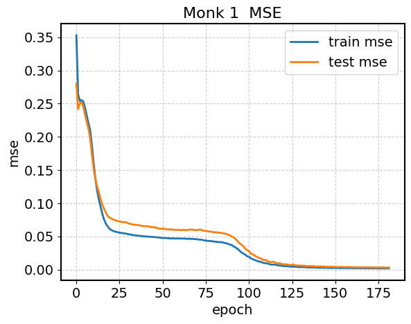    |   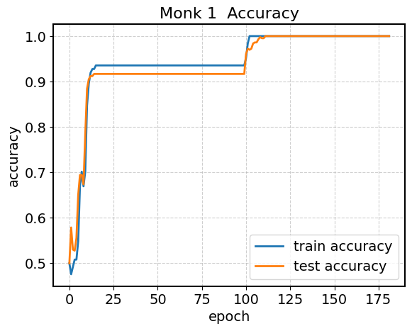    |
|                **Monk 2 - MSE**                 |                **Monk 2 - Accuracy**                 |
|   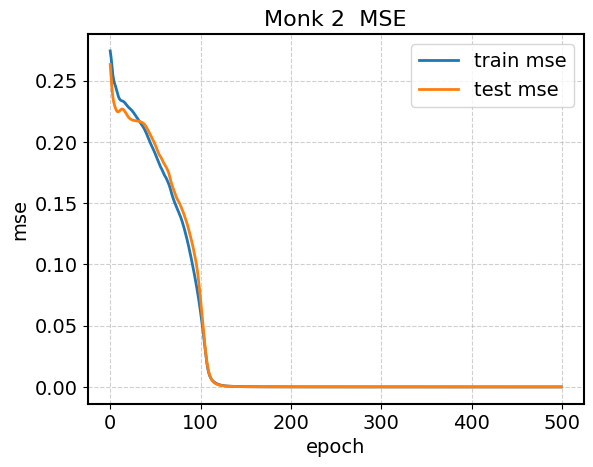    |   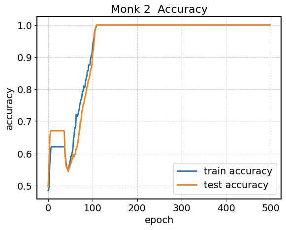    |
|                **Monk 3 - MSE**                 |                **Monk 3 - Accuracy**                 |
|   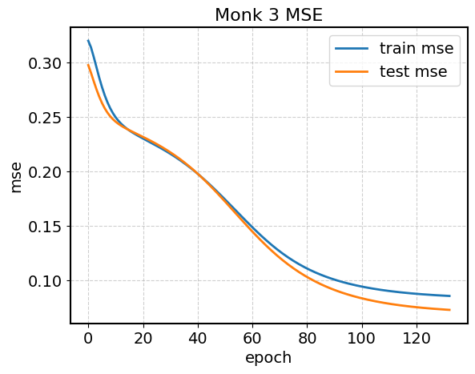    |   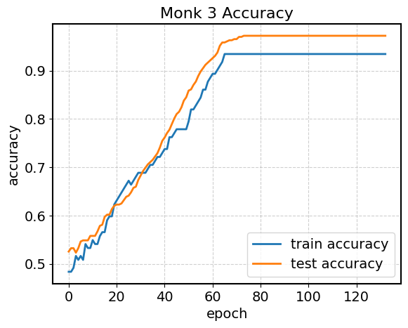    |
|            **Monk 3 - No L2 - Loss**            |            **Monk 3 - No L2 - Accuracy**             |
|  | 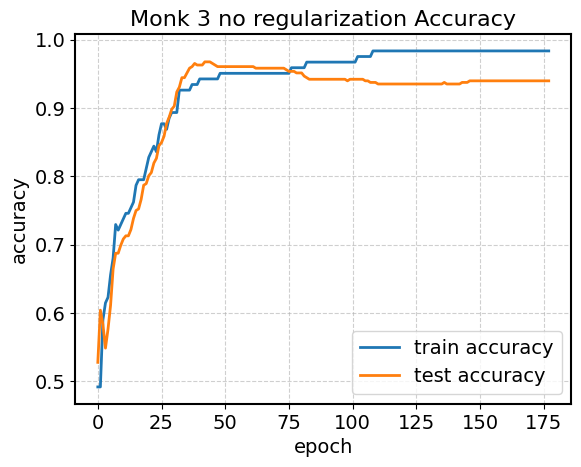 |

See [Appendix](#appendix) for the loss plot.

## ML Cup
### Grid Search Hyperparameter Space
| Hyperparameter         | Values                 |
| ---------------------- | ---------------------- |
| Input Neurons          | 12                     |
| Output Neurons         | 4                      |
| Hidden Layers          | 1, 2                   |
| Hidden Layers Sizes    | 8, 16, 32              |
| Hidden Activation      | Tanh, ReLU, Leaky ReLU |
| Output Activation      | Linear                 |
| Loss Function          | MSE                    |
| Learning Rate ($\eta$) | 0.1, 0.05              |
| Momentum ($\alpha$)    | 0, 0.5, 0.9            |
| L2 Reg. ($\lambda$)    | 0, 0.1, 0.001          |
| Batch Size             | 64, full batch         |
| Epochs                 | 1000                   |
| Patience               | 100                    |


### Best Configuration
|   Units   |  Act. Functions  | Loss  |  Eta  | Lambda | Alpha | Mini-Batches | Avg. Epochs | MEE (TR/VL) | MEE (Internal TS) |
| :-------: | :--------------: | :---: | :---: | :----: | :---: | :----------: | :---------: | :---------: | :---------------- |
| [12,16,4] | [tanh, identity] | M.S.E |  0.1  | 0.001  |  0.9  |     full     |     827     |    19.59    | 22.46             |

## Plots
|             **Monk 1 - Loss**              |              **Monk 2 - Loss**              |
| :----------------------------------------: | :-----------------------------------------: |
| 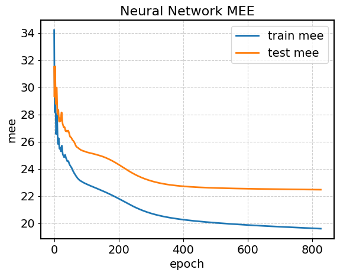 | 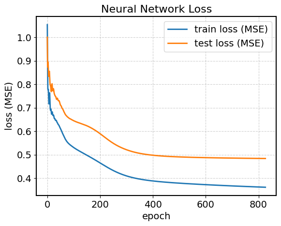 |


## Appendix
|              **Monk 1 - Loss**              |                **Monk 2 - Loss**                 |
| :-----------------------------------------: | :----------------------------------------------: |
| 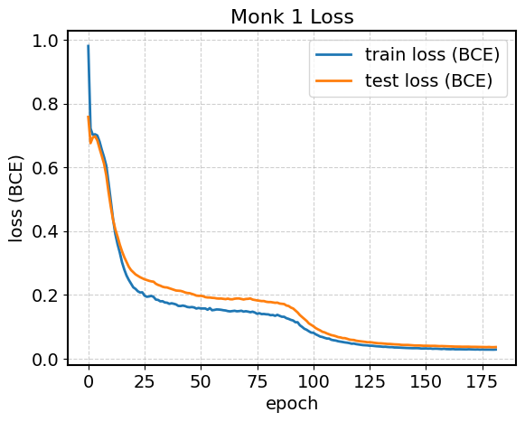 |   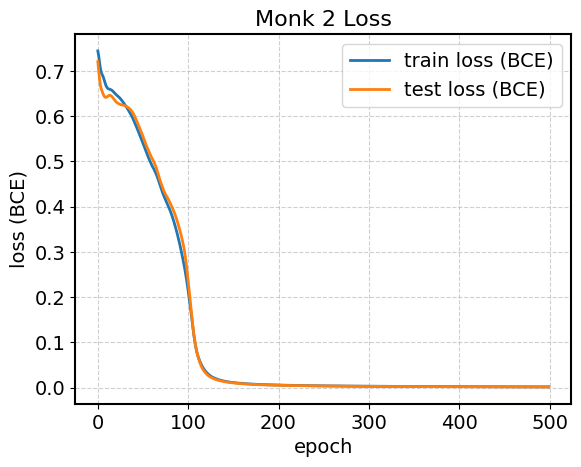    |
|              **Monk 3 - Loss**              |            **Monk 3 - No L2 - Loss**             |
| 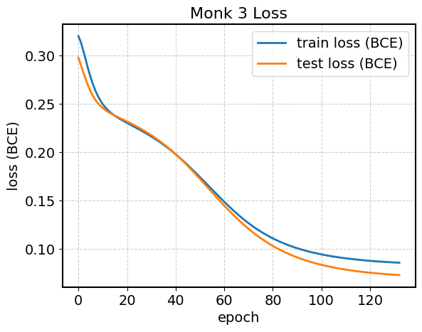 | 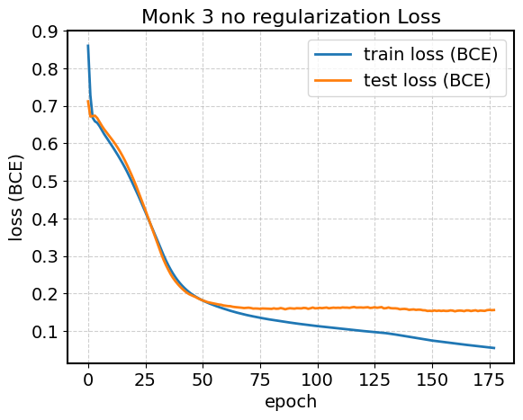 |
